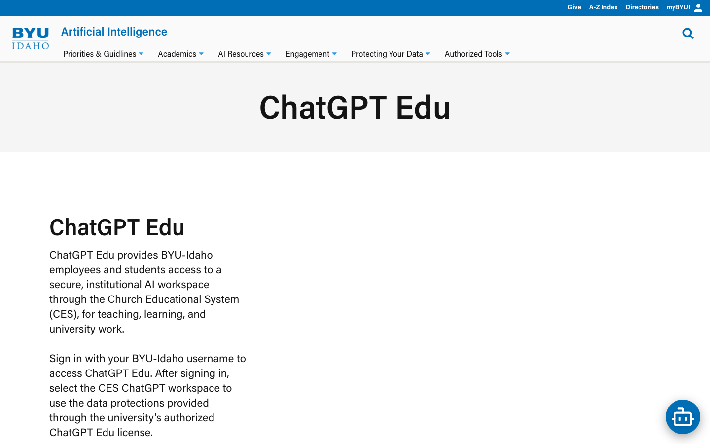
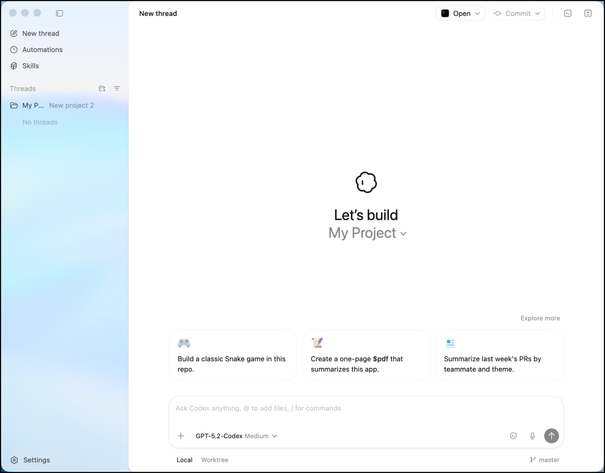
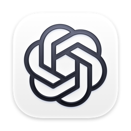

## The setup path {.center-title}

 

Get from a BYU-I account to a working Codex extension in VS Code.

 

::: {.callout-note appearance="simple"}
**Four checkpoints:** account access · workspace choice · Codex install · VS Code connection
:::

---

## BYU-I ChatGPT access

::: columns
::: {.column width="58%"}

<small>Source: [byui.edu/ai/tools/chatgpt](https://www.byui.edu/ai/tools/chatgpt)</small>
:::

::: {.column width="42%"}
Start at the BYU-I ChatGPT page.

1. Select the BYU-I ChatGPT access link.
2. Choose **Church Educational System**.
3. Complete the CES sign-in flow with your BYU-I credentials.

::: {.timer-button}

:::
:::
:::

---

## The sign-in screen

::: columns
::: {.column width="58%"}

:::

::: {.column width="42%"}
Choose **Church Educational System**.

For this setup, choose CES so you enter through the BYU-I access path.
:::
:::

---

## Existing workspace choices

::: columns
::: {.column width="58%"}

:::

::: {.column width="42%"}
When ChatGPT adds you to the BYU-I Edu workspace, it may ask what to do with an existing workspace.

Choose the option that matches your situation:

- **Transfer existing chat history and GPTs** to merge into the Edu workspace
- **Export and delete existing chat history** to remove the existing workspace
:::
:::

---

## Install Codex {.center-title background-color="#1a3a5c"}

Download Codex from [openai.com/codex](https://openai.com/codex/).

 

::: {.callout-note appearance="simple"}
Use the installer for your operating system, then open Codex and sign in with the BYU-I ChatGPT account you just connected.
:::

::: {.notes}
Codex app screenshot: The New Stack, [IDEclined](https://thenewstack.io/ide-vs-desktop-agent/), accessed September 9, 2026.
:::

---

## VS Code connection {background-color="#2a6f97"}

::: columns
::: {.column width="68%"}
1. Install [Visual Studio Code](https://code.visualstudio.com/).
2. Install the [Codex extension](https://marketplace.visualstudio.com/items?itemName=OpenAI.chatgpt).
3. Open the VS Code command palette:

::: {.prompt-box}
Mac: cmd + shift + p  ·  Windows: ctrl + shift + p
:::

4. Select **Codex: Open Codex Side Bar**.

 

::: {.callout-tip appearance="simple"}
If the Codex side bar opens, the VS Code connection is working.
:::
:::

::: {.column width="32%"}

Visual Studio Code + Codex

:::
:::

::: {.notes}
Logo references: [Visual Studio Code brand guidelines](https://code.visualstudio.com/brand) and [OpenAI design guidelines](https://openai.com/brand/). Local assets are used so the deck remains self-contained.
:::

---

## Activity: Build a teaching tool

Work with a partner or two. Use VS Code and Codex to create a useful teaching tool for one of your classes.

 

Choose an idea or adapt one of these examples:

- Use the Quarto tool to make a small website where my slides for class can be hosted
- Create a small JavaScript app that can teach about the central limit theorem
- Create an interactive diagram that helps students understand determinants

 

::: {.callout-note appearance="simple"}
Github is a very valuable tool to make these little tools published on the web.
:::

---

## Ready for daily use

You are set up when you can:

- Open ChatGPT in the BYU-I Edu workspace
- Open the Codex app
- Open the Codex side bar inside VS Code

 

 

[View the setup chat log](chat_log.md)
