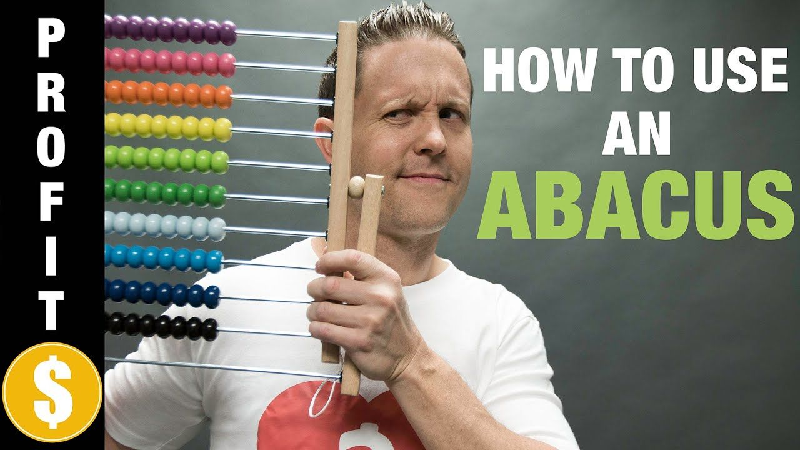

## The lasting artifact is the learner

The homework, project, or exam is temporary. The durable outcome is what develops **within the student** while doing the work.

 

::: {.big-claim}
The educational task is to move students from novice to expert.
:::

> GenAI amplifies existing expertise, but its unchecked adoption by students hinders their ability to develop that expertise.

Learning sciences

Students need a working mental model of the systems they interact with.

Professional judgment

An accurate mental model supports causal reasoning: make a prediction, test it, and update the model.

::: {.source-note}
Research frame: DiSessa (1982); Schauble et al. (1991); paper, “What is learning?”
:::

---

## Statistics is a system, not just a task

In statistics and data science, students must connect:

Data context

What was measured? Who or what do the observations represent? What could make the data misleading?

Models and software

What does a regression model assume? What does the code calculate? What does the output mean here?

 

GenAI can produce accurate explanations of regression and write R or Python code. It can also complete many tasks we assign in introductory courses.

::: {.callout-note appearance="simple"}
The visible task may be automated. The mental model still has to belong to the student.
:::

::: {.source-note}
Paper, “What is learning?”; DeLuca et al. (2025); Lu et al. (2025)
:::

---

## The same tool behaves differently for novices

Experts

GenAI can extend knowledge and experience, helping experts work faster and explore more possibilities.

 

They can triage suggestions, check claims, and frame the next question.

Novices

GenAI can lead them toward an answer to the wrong question.

 

They may not know what to ask, cannot reliably judge false output, and may mistake a fluent conversation for learning.

 

::: {.big-claim}
GenAI works primarily as an amplifier of the skills a person already has.
:::

::: {.source-note}
Daniotti et al. (2026); Prather et al. (2023, 2024); Fan et al. (2025); paper, “Early returns on learning with generative AI”
:::

---

## The abacus is the warning {.dark-slide background-color="#1a3a5c"}

A quick test

Watch the <a href="https://youtu.be/SYRyKYmOJwM?si=NeOWw5iaRnE4JYIz&t=123">abacus demonstration</a> and ask:

 

**How long would students pay attention if the only goal were to pass a test?**

 

The point is not to defend an old tool because it is familiar. The point is to identify what the tool was supposed to develop, then design a better route to that capability.

::: {.source-note}
J. Hathaway's thoughts.
:::

---

## A case for new kinds of practice {.dark-slide background-color="#1a3a5c"}

> With GenAI we need new problems and assignments that require persistence and endurance, because our historical assignments feel a bit like learning how to use an abacus. It is a skill we can develop and perform quickly, but it will not be very helpful for thinking or employment in modern society.

 

::: {.closing-line}
Practice still matters when it builds the capacity students need next.
:::

::: {.source-note}
J. Hathaway's thoughts.
:::

---

## Assessment should reveal the learning goal

The authors are re-orienting courses around assessments in AI-free environments:

Foundational understanding

Use in-class quizzes, exams, oral explanations, and other settings where the student must retrieve and reason independently.

Future practice

Use GenAI where it helps students extend an established mental model into authentic analysis, communication, or production.

 

This is an alignment decision, not a technology ban: **assess what we say matters**.

::: {.source-note}
Paper, “What our key constituencies need to know about learning with GenAI” and “Conclusion and Paths Forward”
:::

---

## A path forward for statistics educators

The paper closes with a shared responsibility:

Set boundaries

Make the role of GenAI explicit in each assignment and assessment.

 

Explain why the practice is worth the effort.

Do the research

Study where GenAI helps learning and where it replaces the learning process.

 

Keep students connected to faculty, peers, and the work itself.

 

::: {.big-claim}
Build the expertise so AI can amplify it.
:::

::: {.source-note}
Discussion source: An et al., 2026. Full paper: “Generative AI paper.pdf” in this folder.
:::

---

## Sources and a question to carry forward

**Primary source**

[An, Ming-Wen, et al. “Generative AI hasn't changed learning: It's still hard to become an expert.” 2026.](https://beanumber.github.io/aalac2026/manuscript/#sec-workshop)

**Selected research cited by the authors**

DiSessa (1982); Ericsson and Pool (2017); Willingham (2008); DeLuca et al. (2025); Lu et al. (2025); Prather et al. (2023, 2024); Fan et al. (2025); Liu et al. (2026).

 

::: {.callout-note appearance="simple"}
What should students be able to do without AI so that they can use AI well later?
:::

::: footer-cite
Quote selections and discussion prompts adapted from ai_stats_leaders/mynotes.md
:::
