## You don't need to be a programmer {#why .dark-slide background-color="#183a57"}

<span class="kicker">Why and what</span>

<div class="lede">An AI helper inside an editor can read your files, write new ones, change what is there, and run tools for you.</div>

<div class="big-claim">Today is setup, not coding.</div>

::: {.notes}
Set the tone: nobody needs to understand code. We are building a workspace where an AI can do real work on files, and where the person stays in charge.
:::

## Three things we'll set up {#three-things}

<span class="kicker">Why and what</span>

<div class="roadmap">
<div><span>1</span><p>VS Code<small>The editor, where your files and the AI live together.</small></p></div>
<div><span>2</span><p>An AI helper<small>Codex, in a sidebar next to your files.</small></p></div>
<div><span>3</span><p>A toolbox<small>Small command-line tools: the helper's hands.</small></p></div>
</div>

::: {.notes}
Target for the end: the AI builds a small slide deck, renders it, and screenshots it, all inside this window. Show a finished screen if available.
:::

## Download VS Code {#download-vscode}

<span class="kicker">Install and open</span>

<ol class="steps">
<li>Go to <a href="https://code.visualstudio.com">code.visualstudio.com</a>.</li>
<li>Click the big download button. It picks Mac or Windows for you.</li>
<li>Wait for the file to finish downloading.</li>
</ol>

<div class="check">A file named like VSCode-darwin or VSCodeUserSetup is in your Downloads folder.</div>

<div class="learn"><a href="#/tool-vscode">What is VS Code? →</a></div>

::: {.notes}
Screenshot to add: the VS Code download page.
:::

## Install it {#install-vscode}

<span class="kicker">Install and open</span>

:::: {.os-cols}
::: {}
<span class="label">Mac</span>

<p>Open the downloaded file, drag <b>Visual Studio Code</b> into <b>Applications</b>, then open it from there.</p>
:::
::: {}
<span class="label">Windows</span>

<p>Run the installer. Accept the defaults and leave <b>Add to PATH</b> checked.</p>
:::
::::

<div class="check">The VS Code welcome screen opens.</div>

::: {.notes}
Screenshots to add: Mac drag-to-Applications, Windows installer options page.
:::

## Four things to know {#tour}

<span class="kicker">Install and open</span>

<div class="lede">You only need these four parts of the window.</div>

<div class="grid4">
<div>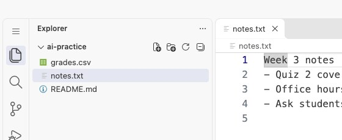<h3>Sidebar</h3><p>Your files and folders, on the left.</p></div>
<div>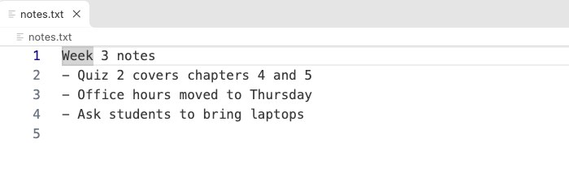<h3>Editor</h3><p>The middle: where a file opens.</p></div>
<div>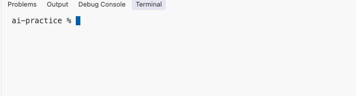<h3>Terminal</h3><p>Where commands run. Open it from the Terminal menu.</p></div>
<div>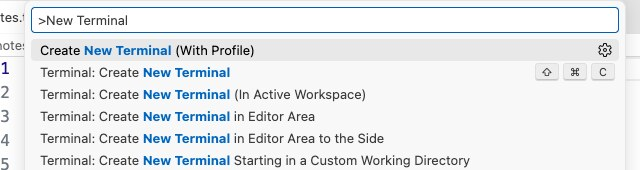<h3>Command palette</h3><p>Search every action. Mac <kbd>cmd</kbd>+<kbd>shift</kbd>+<kbd>P</kbd>, Windows <kbd>ctrl</kbd>+<kbd>shift</kbd>+<kbd>P</kbd>.</p></div>
</div>

## Make a project folder {#project-folder}

<span class="kicker">Install and open</span>

<ol class="steps">
<li>Create a folder named <code>ai-practice</code> in your Documents folder.</li>
<li>In VS Code, choose <b>File → Open Folder</b> and pick it.</li>
<li>When asked, choose <b>Yes, I trust the authors</b>.</li>
</ol>

<div class="check">The name <code>ai-practice</code> shows at the top of the sidebar.</div>

## Add the AI helper {#install-ai-extension}

<span class="kicker">Add the AI</span>

<div class="split">
<div>

<ol class="steps">
<li>Click the <b>Extensions</b> icon in the left bar (four squares).</li>
<li>Search for <b>Codex</b> and choose the one from <b>OpenAI</b>.</li>
<li>Click <b>Install</b>.</li>
</ol>

<div class="check">A Codex icon appears in the left bar.</div>

</div>
<div class="shotrow">
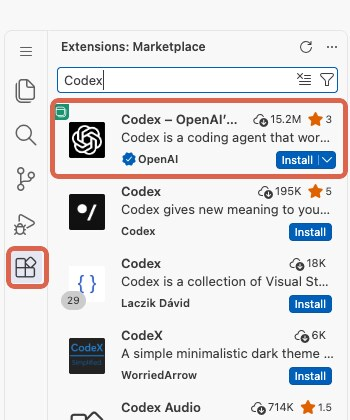
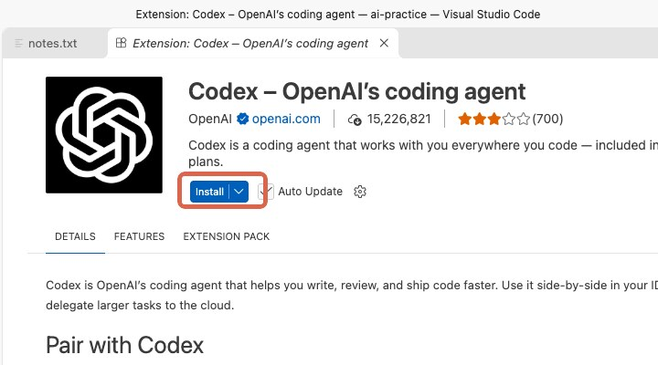
</div>
</div>

<div class="learn"><a href="#/tool-codex">What is Codex? →</a></div>

::: {.notes}
Marketplace page: https://marketplace.visualstudio.com/items?itemName=OpenAI.chatgpt
:::

## Get your BYU-I ChatGPT access {#sign-in}

<span class="kicker">Add the AI</span>

<ol class="steps">
<li>Go to <a href="https://www.byui.edu/ai/tools/chatgpt">byui.edu/ai/tools/chatgpt</a> and select the access link.</li>
<li>Choose <b>Church Educational System</b>.</li>
<li>Enter your BYU-I <b>username</b>@byui.edu. Do not use your other email address.</li>
</ol>

<div class="tip"><b>Not sure of your username?</b> Sign in to Outlook on the web and click your account icon. The address shown is <code>username@byui.edu</code>. Your username is the part before the @.</div>

<div class="check">ChatGPT opens in your browser and you are signed in.</div>

<p class="lede">Already have access? Skip ahead. Screens and workspace choices: see the <a href="../ai_codex/ai-codex-setup-slides.html">Codex at BYU-I</a> deck.</p>

## Open Codex in VS Code {#open-sidebar}

<span class="kicker">Add the AI</span>

<ol class="steps">
<li>Open the command palette.</li>
<li>Select <b>Codex: Open Codex Side Bar</b>.</li>
<li>Skip the guide and notifications that appear.</li>
<li>If it asks you to sign in, sign in with the same account.</li>
</ol>

<div class="check">The Codex side bar opens. That means VS Code is connected.</div>

<p class="lede">Already signed in to the Codex app? VS Code should sign you in automatically.</p>

## A tool is a command the AI can run {#what-is-cli}

<span class="kicker">Give it a toolbox</span>

<div class="lede">The AI can use your computer the way you would from the terminal: by typing commands.</div>

<div class="roadmap">
<div><span>1</span><p>You ask<small>"What changed in my files today?"</small></p></div>
<div><span>2</span><p>The AI runs a command<small>It types <code>git status</code> in the terminal. You approve it first.</small></p></div>
<div><span>3</span><p>It reads the result and answers<small>It explains the output in plain words, and can run the next command.</small></p></div>
</div>

::: {.notes}
Define the word "tool" before the table. Stress that the AI is typing the same commands a person would, and that the person approves each one. The table that follows lists the seven tools we are about to install.
:::

## Without tools, the AI can only talk {#why-tools}

<span class="kicker">Give it a toolbox</span>

| Tool | CLI? | Lets the AI… | What is? |
|------|------|--------------|----------|
| <a href="https://brew.sh">Homebrew</a> / <a href="https://learn.microsoft.com/windows/package-manager/winget/">winget</a> | Yes | install the rest for you | <a href="#/tool-package-manager">Package manager →</a> |
| <a href="https://git-scm.com">Git</a> | Yes | show what it changed, and undo it | <a href="#/tool-git">Git →</a> |
| <a href="https://docs.astral.sh/uv/">uv</a> | Yes | run Python without setup headaches | <a href="#/tool-uv">uv →</a> |
| <a href="https://quarto.org">Quarto</a> | Yes | turn text into slides and documents | <a href="#/tool-quarto">Quarto →</a> |
| <a href="https://playwright.dev">Playwright</a> | Yes | open a page and look at it | <a href="#/tool-playwright">Playwright →</a> |
| <a href="https://nodejs.org">Node.js</a> | Yes | run many AI tools | <a href="#/tool-node">Node.js →</a> |
| <a href="https://github.com">GitHub</a> | No | store your work online | <a href="#/tool-github">GitHub →</a> |
| <a href="https://cli.github.com">GitHub CLI</a> | Yes | work with GitHub from the terminal | <a href="#/tool-gh">GitHub CLI →</a> |

<div class="cli-def">
<span class="label">What is a CLI tool?</span>
<ul>
<li>A program you run by typing its name in the terminal, like <code>git status</code>.</li>
<li>It does real work: installs software, changes files, builds documents, talks to websites.</li>
<li>It reports back in text, so the AI can read the result and choose the next step.</li>
</ul>
</div>

::: {.notes}
Define CLI once, here. Everything in the table except the GitHub website is a CLI tool. GitHub itself is a website you use in a browser; the gh command is its CLI. Stress that CLI tools act (install, change, build, publish), not just display text.
:::

## Every command in one place {#all-commands}

<span class="kicker">Give it a toolbox</span>

:::: {.os-cols}
::: {}
<span class="label">Mac · 1 Package manager</span>

```{.bash .cmd .compact}
/bin/bash -c "$(curl -fsSL https://raw.githubusercontent.com/Homebrew/install/HEAD/install.sh)"
```

<span class="label">2 Tools</span>

```{.bash .cmd .compact}
brew install git uv node gh
brew install --cask quarto
```

<span class="label">3 Set up</span>

```{.bash .cmd .compact}
uv python install
uvx playwright install chromium
gh auth login
```

<span class="label">4 Check</span>

```{.bash .cmd .compact}
git --version; uv --version; quarto --version; node --version; gh --version
```
:::
::: {}
<span class="label">Windows · 1 Tools</span>

```{.bash .cmd .compact}
winget install --id Git.Git -e
winget install --id astral-sh.uv -e
winget install --id Posit.Quarto -e
winget install OpenJS.NodeJS.LTS
winget install --id GitHub.cli -e
```

<p>Close and reopen the terminal.</p>

<span class="label">2 Set up</span>

```{.bash .cmd .compact}
uv python install
uvx playwright install chromium
gh auth login
```

<span class="label">3 Check</span>

```{.bash .cmd .compact}
git --version; uv --version; quarto --version; node --version; gh --version
```
:::
::::

<div class="cmd-hint">Run each block in order.<br>Use the Copy button in the corner of a block.</div>

<div class="cmd-qr"><span><b>Copy these on your computer</b><a href="https://shortie.fyi/ai-commands">shortie.fyi/ai-commands</a></span></div>

::: {.notes}
Mac: Homebrew asks for your password and runs on its own, so it is its own block. Windows: reopen the terminal after the winget installs so the new commands are found. gh auth login is interactive: choose GitHub.com, HTTPS, Login with a web browser.
:::

## Install the package manager {#install-package-manager}

<span class="kicker">Give it a toolbox</span>

<div class="ai-can"><span class="label">What the AI can do</span><p>With a package manager, the AI can install the rest of your tools for you.</p></div>

<div class="lede">Open the terminal: <b>Terminal → New Terminal</b>. Paste the command for your computer.</div>

:::: {.os-cols}
::: {}
<span class="label">Mac · Homebrew</span>

```{.bash .cmd}
/bin/bash -c "$(curl -fsSL https://raw.githubusercontent.com/Homebrew/install/HEAD/install.sh)"
```

<p>Follow the prompts. Enter your Mac password when asked.</p>
:::
::: {}
<span class="label">Windows · winget</span>

```{.bash .cmd}
winget --version
```

<p>Windows already includes winget. If a version number prints, you are done.</p>
:::
::::

<div class="check">A version number prints. On Mac, run <code>brew --version</code>.</div>

<div class="learn"><a href="#/tool-package-manager">What is a package manager? →</a></div>

## Git, uv, and Quarto {#install-git-uv-quarto}

<span class="kicker">Give it a toolbox</span>

<div class="ai-can"><span class="label">What the AI can do</span><p>With <b>Git</b>, the AI can show you what it changed, and undo it.</p><p>With <b>uv</b>, the AI can run Python for you without any setup headaches.</p><p>With <b>Quarto</b>, the AI can turn plain text into slides and documents.</p></div>

:::: {.os-cols}
::: {}
<span class="label">Mac</span>

```{.bash .cmd}
brew install git uv
brew install --cask quarto
```
:::
::: {}
<span class="label">Windows</span>

```{.bash .cmd}
winget install --id Git.Git -e
winget install --id astral-sh.uv -e
winget install --id Posit.Quarto -e
```

<p>Close and reopen the terminal afterward.</p>
:::
::::

<div class="check"><code>git --version</code>, <code>uv --version</code>, and <code>quarto --version</code> each print a number.</div>

<div class="learn"><a href="#/tool-git">What is Git? →</a><a href="#/tool-uv">What is uv? →</a><a href="#/tool-quarto">What is Quarto? →</a></div>

::: {.notes}
uv manages Python from here on, so there is no separate Python installer.
:::

## Install Python {#install-python}

<span class="kicker">Give it a toolbox</span>

<div class="ai-can"><span class="label">What the AI can do</span><p>With <b>uv</b>, the AI can run Python for you without any setup headaches.</p></div>

<div class="lede">uv installs Python for you. The command is the same on Mac and Windows. Open a new terminal first.</div>

```{.bash .cmd}
uv python install
uv run python --version
```

<p class="lede">The AI will run Python through <code>uv run</code>, so you never manage Python yourself.</p>

<div class="check">A version like <code>Python 3.13</code> prints.</div>

<div class="learn"><a href="#/tool-uv">What is uv? →</a></div>

::: {.notes}
uv does not download Python until asked. This slide is the step that actually installs it. On Windows the terminal must be reopened after the winget install so uv is found.
:::

## Playwright and Node {#install-playwright-node}

<span class="kicker">Give it a toolbox</span>

<div class="ai-can"><span class="label">What the AI can do</span><p>With <b>Playwright</b>, the AI can open a web page and look at it.</p><p>With <b>Node.js</b>, the AI can run many other AI tools.</p></div>

:::: {.os-cols}
::: {}
<span class="label">Mac</span>

```{.bash .cmd}
uvx playwright install chromium
brew install node
```
:::
::: {}
<span class="label">Windows</span>

```{.bash .cmd}
uvx playwright install chromium
winget install OpenJS.NodeJS.LTS
```

<p>Close and reopen the terminal afterward.</p>
:::
::::

<div class="check"><code>node --version</code> prints a number, and the Playwright install finishes without errors.</div>

<div class="learn"><a href="#/tool-playwright">What is Playwright? →</a><a href="#/tool-node">What is Node.js? →</a></div>

## Create a GitHub account {#create-github-account}

<span class="kicker">Give it a toolbox</span>

<div class="ai-can"><span class="label">What the AI can do</span><p>With <b>GitHub</b>, the AI can store your work online.</p></div>

<ol class="steps">
<li>Go to <a href="https://github.com/signup">github.com/signup</a>.</li>
<li>Use an email you will keep. Pick a professional username.</li>
<li>Verify your email, then turn on two-factor authentication.</li>
</ol>

<p class="lede">The free plan is enough. Nothing you make is public unless you choose that.</p>

<div class="check">You can sign in at github.com and see your empty profile.</div>

<div class="learn"><a href="#/tool-github">What is GitHub? →</a><a href="#/backup-github-trouble">Trouble signing up? →</a></div>

## Connect GitHub to your computer {#connect-github}

<span class="kicker">Give it a toolbox</span>

<div class="ai-can"><span class="label">What the AI can do</span><p>With the <b>GitHub CLI</b>, the AI can work with GitHub from the terminal.</p></div>

:::: {.os-cols}
::: {}
<span class="label">Mac</span>

```{.bash .cmd}
brew install gh
gh auth login
```
:::
::: {}
<span class="label">Windows</span>

```{.bash .cmd}
winget install --id GitHub.cli -e
gh auth login
```
:::
::::

<p class="lede">Choose <b>GitHub.com</b>, <b>HTTPS</b>, then <b>Login with a web browser</b>.</p>

<div class="check"><code>gh auth status</code> says you are logged in.</div>

<div class="learn"><a href="#/tool-gh">What is the GitHub CLI? →</a></div>

## Let the AI check its own toolbox {#toolbox-check}

<span class="kicker">Give it a toolbox</span>

<div class="lede">Your first real task for the AI. It runs the commands. You approve each one.</div>

<div class="prompt">Run the version command for git, uv, quarto, gh, node, and playwright. Check that Python runs with uv run python --version. Check that I am logged in to GitHub. In this folder, run git init and set my Git name and email from my GitHub account. Tell me what is missing.</div>

<div class="check">The AI reports a version for each tool. Anything missing, it offers to install.</div>

::: {.notes}
Teach approval prompts here: read each command before allowing it.
:::

## Build something and see it {#build-and-see}

<span class="kicker">Use it for real</span>

<div class="prompt">Make a one-slide Quarto deck about [a topic from my course]. Render it, then use Playwright to take a screenshot of the slide.</div>

<ol class="steps">
<li>Watch the AI write the file, render it, and open it.</li>
<li>Open the screenshot it saved in the sidebar.</li>
</ol>

<div class="check">You have a <code>.qmd</code> file, a rendered <code>.html</code> file, and a screenshot.</div>

## Ask for a change {#change-a-file}

<span class="kicker">Use it for real</span>

<div class="prompt">Make the title bigger and use a navy background. Take a new screenshot.</div>

<ol class="steps">
<li>Read the change the AI proposes before accepting it.</li>
<li>Choose <b>Accept</b> or <b>Reject</b>.</li>
<li>Compare the new screenshot with the first one.</li>
</ol>

## You stay in charge {#in-charge}

<span class="kicker">Use it for real</span>

> "When intelligence is plentiful, volition is valuable."

<div class="source-note">David Brooks, "The People Who Will Thrive in the AI Age," <i>The Atlantic</i>, June 28, 2026.</div>

<div class="prompt">Show me what you changed since the last commit.</div>

<p class="lede">Git shows every change. Read it, keep it, or undo it: <code>git restore filename</code>.</p>

## Where to go next {#next}

<span class="kicker">Use it for real</span>

<ol class="steps">
<li>Try the same steps on a real task: a syllabus, a quiz bank, a data file.</li>
<li>Save the project to GitHub: ask the AI to run <code>gh repo create</code>.</li>
</ol>

<div class="learn"><a href="#/backup-terminal">What is the terminal? →</a><a href="#/backup-troubleshooting">Something not working? →</a><a href="#/backup-r-rig">Need R? →</a><a href="#/claude-intro">Using Claude? →</a></div>

## Backup and appendix slides {#appendix-divider .dark-slide background-color="#183a57"}

<span class="kicker">After the main deck</span>

<div class="lede">The main deck ends at slide 24. What follows is for when you need it. Jump in with a link, or keep paging.</div>

<div class="roadmap">
<div><span>1</span><p><a href="#/backup-terminal">Backup</a> · slides 26–29<small>What is the terminal? · Need R? (rig) · When a command is not found · GitHub sign-up trouble</small></p></div>
<div><span>2</span><p><a href="#/claude-intro">Appendix A: Using Claude</a> · slides 30–35<small>Install the extension · Sign in · Terminal install · Same prompts · Codex or Claude?</small></p></div>
<div><span>3</span><p><a href="#/tool-vscode">Appendix B: Tool profiles</a> · slides 36–46<small>One page per tool: VS Code · Codex · package manager · Git · uv · Quarto · Playwright · Node.js · GitHub · GitHub CLI · rig</small></p></div>
</div>

<div class="learn"><a href="#/next">← Back to Where to go next</a></div>

## What is the terminal? {#backup-terminal}

<span class="kicker">Backup</span>

<div class="lede">A place to give your computer written instructions instead of clicking.</div>

<ul>
<li>Open it in VS Code: <b>Terminal → New Terminal</b>.</li>
<li>Type a command, press Enter, read the reply.</li>
<li>You never have to memorize commands. The AI types them, and you approve.</li>
</ul>

<div class="profile-links"><a class="back" href="#/next">← Back to Where to go next</a></div>

## Need R? Install it with rig {#backup-r-rig}

<span class="kicker">Backup · for statistics faculty</span>

:::: {.os-cols}
::: {}
<span class="label">Mac</span>

```{.bash .cmd}
brew tap r-lib/rig
brew install --cask rig
rig add release
```
:::
::: {}
<span class="label">Windows</span>

```{.bash .cmd}
winget install posit.rig
rig add release
```
:::
::::

<div class="check"><code>R --version</code> prints a version. Quarto can now run R code chunks.</div>

<div class="learn"><a href="#/tool-rig">What is rig? →</a></div>

<div class="profile-links"><a class="back" href="#/next">← Back to Where to go next</a></div>

## When a command is not found {#backup-troubleshooting}

<span class="kicker">Backup</span>

<ul>
<li><b>"command not found" or "not recognized":</b> close the terminal and open a new one. Installers update your path only for new windows.</li>
<li><b>A download is blocked:</b> try another network, or ask the AI to explain the error.</li>
<li><b>Codex sign-in loops:</b> sign out, restart VS Code, sign in again.</li>
<li><b>Stuck anywhere:</b> paste the whole error into the AI and ask what it means.</li>
</ul>

<div class="profile-links"><a class="back" href="#/next">← Back to Where to go next</a></div>

## GitHub sign-up trouble {#backup-github-trouble}

<span class="kicker">Backup</span>

<ul>
<li><b>No verification email:</b> check spam, then use <b>Resend</b> on the GitHub page.</li>
<li><b>Username taken:</b> add your initials or your department.</li>
<li><b>Lost your two-factor device:</b> use the recovery codes you saved at sign-up.</li>
<li><b>Browser step stuck in <code>gh auth login</code>:</b> copy the one-time code by hand and open github.com/login/device.</li>
<li><b>BYU-I email or personal?</b> A personal email lasts; a work email can be added as a second address.</li>
</ul>

<div class="profile-links"><a class="back" href="#/create-github-account">← Back to Create a GitHub account</a></div>

## Using Claude instead of Codex {#claude-intro}

<span class="kicker">Appendix A · Claude</span>

<div class="lede">Same workspace, same tools, different helper.</div>

<ul>
<li>Claude uses its own account and sign-in.</li>
<li>Everything else in this deck stays the same: VS Code, the toolbox, the prompts.</li>
</ul>

<div class="learn"><a href="#/claude-extension">Install the extension →</a><a href="#/next">← Back to Where to go next</a></div>

## Install the Claude Code extension {#claude-extension}

<span class="kicker">Appendix A · Claude</span>

<ol class="steps">
<li>Open <b>Extensions</b> in VS Code.</li>
<li>Search for <b>Claude Code</b> and choose the one from <b>Anthropic</b>.</li>
<li>Click <b>Install</b>.</li>
</ol>

<div class="check">A Claude icon appears in the editor or the left bar.</div>

## Sign in to Claude {#claude-signin}

<span class="kicker">Appendix A · Claude</span>

<ol class="steps">
<li>Open the Claude panel.</li>
<li>Choose to sign in with your personal Claude subscription (Pro or Max).</li>
<li>Approve the sign-in in your browser, then return to VS Code.</li>
</ol>

<div class="check">The Claude panel shows a chat box.</div>

## Claude in the terminal (optional) {#claude-terminal}

<span class="kicker">Appendix A · Claude</span>

:::: {.os-cols}
::: {}
<span class="label">Mac</span>

```{.bash .cmd}
curl -fsSL https://claude.ai/install.sh | bash
claude --version
```
:::
::: {}
<span class="label">Windows · PowerShell</span>

```{.bash .cmd}
irm https://claude.ai/install.ps1 | iex
claude --version
```
:::
::::

<div class="check"><code>claude --version</code> prints a number.</div>

## Same prompts, new helper {#claude-prompts}

<span class="kicker">Appendix A · Claude</span>

<div class="lede">Re-run these with Claude and compare.</div>

<ol class="steps">
<li>The toolbox check (<a href="#/toolbox-check">slide: Let the AI check its own toolbox</a>).</li>
<li>The one-slide Quarto deck with a Playwright screenshot (<a href="#/build-and-see">slide: Build something and see it</a>).</li>
</ol>

## Codex or Claude? {#claude-compare}

<span class="kicker">Appendix A · Claude</span>

| | Codex | Claude |
|---|-------|--------|
| Account | BYU-I ChatGPT access | Personal Claude subscription |
| Runs in | VS Code sidebar | VS Code panel and terminal |
| Approvals | Asks before running commands | Asks before running commands |

<div class="profile-links"><a class="back" href="#/next">← Back to Where to go next</a></div>

::: {.notes}
Fill in cost and plan details once confirmed.
:::

## VS Code: the editor where everything happens {#tool-vscode}

<span class="kicker">Appendix B · Tool profile</span>


:::: {.profile-grid}
::: {.profile-text}
<div class="pf"><span class="label">What it is</span><p>A free editor for text and code files. Your files, the terminal, and the AI helper all sit in one window.</p></div>
<div class="pf"><span class="label">What the AI uses it for</span><p>It reads the files in your open folder and proposes changes you can accept or reject.</p></div>
<div class="pf"><span class="label">Try it</span><p>Open a folder, then open the command palette.</p></div>
:::
::: {.profile-shot}
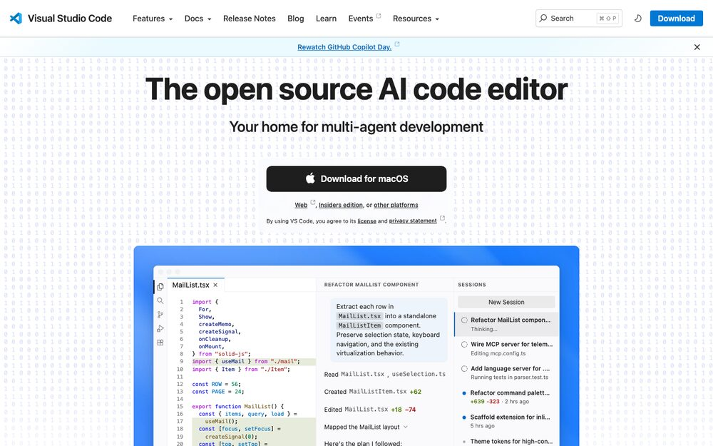
<div class="cap">code.visualstudio.com · screenshot, October 2026. Logos and screenshots belong to their owners.</div>
:::
::::

<div class="profile-links"><a href="https://code.visualstudio.com">code.visualstudio.com</a><a class="back" href="#/download-vscode">← Back to Download VS Code</a></div>

## Codex: the AI helper in your sidebar {#tool-codex}

<span class="kicker">Appendix B · Tool profile</span>


:::: {.profile-grid}
::: {.profile-text}
<div class="pf"><span class="label">What it is</span><p>OpenAI's coding assistant, added to VS Code as an extension. You chat with it next to your files.</p></div>
<div class="pf"><span class="label">What the AI uses it for</span><p>"Summarize this file." "Add a title slide." "Run this command and tell me what happened."</p></div>
<div class="pf"><span class="label">Try it</span><p>Ask it: <i>What files are in this folder?</i></p></div>
:::
::: {.profile-shot}
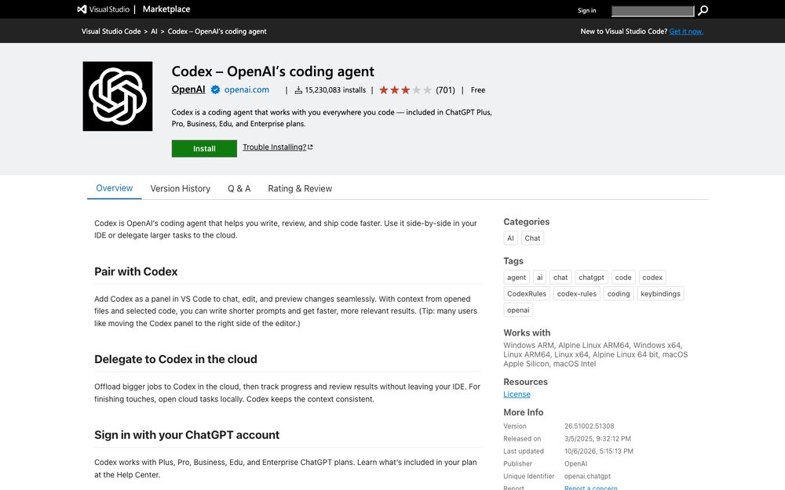
<div class="cap">marketplace.visualstudio.com · screenshot, October 2026. Logos and screenshots belong to their owners.</div>
:::
::::

<div class="profile-links"><a href="https://marketplace.visualstudio.com/items?itemName=OpenAI.chatgpt">Marketplace page</a><a class="back" href="#/install-ai-extension">← Back to Add the AI helper</a></div>

## A package manager: an app store for the terminal {#tool-package-manager}

<span class="kicker">Appendix B · Tool profile</span>


:::: {.profile-grid}
::: {.profile-text}
<div class="pf"><span class="label">What it is</span><p>Homebrew (Mac) and winget (Windows) install and update software from the terminal, with one line each.</p></div>
<div class="pf"><span class="label">What the AI uses it for</span><p>"Install Quarto for me." It runs the install, so you never hunt for download pages.</p></div>
<div class="pf"><span class="label">Try it</span><p>Mac: <code>brew list</code> · Windows: <code>winget list</code></p></div>
:::
::: {.profile-shot}
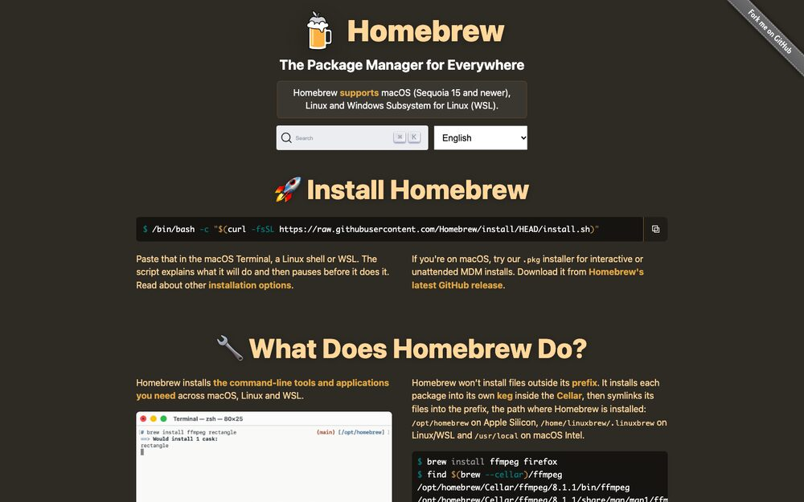
<div class="cap">brew.sh · screenshot, October 2026. Logos and screenshots belong to their owners.</div>
:::
::::

<div class="profile-links"><a href="https://brew.sh">brew.sh</a><a href="https://learn.microsoft.com/windows/package-manager/winget/">winget docs</a><a class="back" href="#/install-package-manager">← Back to Install the package manager</a></div>

## Git: the undo button for your files {#tool-git}

<span class="kicker">Appendix B · Tool profile</span>


:::: {.profile-grid}
::: {.profile-text}
<div class="pf"><span class="label">What it is</span><p>A tool that remembers every version of your files, so you can see what changed and go back.</p></div>
<div class="pf"><span class="label">What the AI uses it for</span><p>"Show me what changed since yesterday." "Undo that last edit."</p></div>
<div class="pf"><span class="label">Try it</span><p><code>git status</code> lists files that changed.</p></div>
:::
::: {.profile-shot}
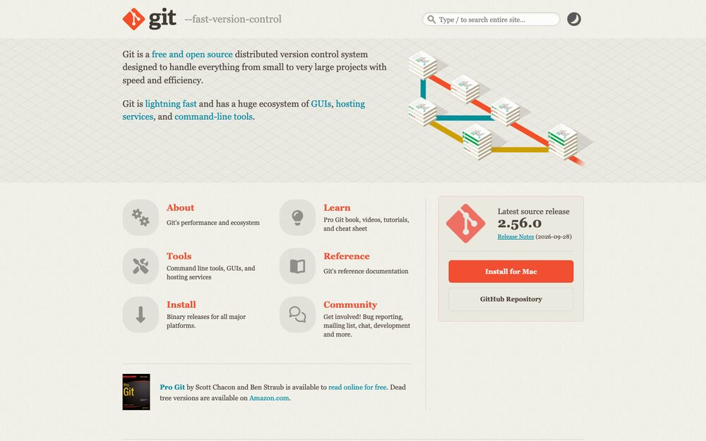
<div class="cap">git-scm.com · screenshot, October 2026. Logos and screenshots belong to their owners.</div>
:::
::::

<div class="profile-links"><a href="https://git-scm.com">git-scm.com</a><a class="back" href="#/install-git-uv-quarto">← Back to Git, uv, and Quarto</a></div>

## uv: Python without the setup headaches {#tool-uv}

<span class="kicker">Appendix B · Tool profile</span>


:::: {.profile-grid}
::: {.profile-text}
<div class="pf"><span class="label">What it is</span><p>A fast tool that installs Python and runs Python programs, so you never install Python by hand.</p></div>
<div class="pf"><span class="label">What the AI uses it for</span><p>"Run this script." "Install the chart library and make a plot."</p></div>
<div class="pf"><span class="label">Try it</span><p><code>uv python install</code> installs Python. <code>uv run python --version</code> prints its version.</p></div>
:::
::: {.profile-shot}
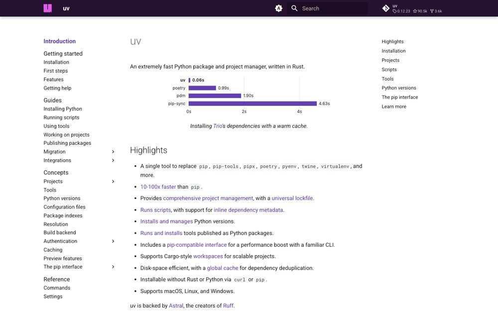
<div class="cap">docs.astral.sh/uv · screenshot, October 2026. Logos and screenshots belong to their owners.</div>
:::
::::

<div class="profile-links"><a href="https://docs.astral.sh/uv/">docs.astral.sh/uv</a><a class="back" href="#/install-git-uv-quarto">← Back to Git, uv, and Quarto</a></div>

## Quarto: text in, slides and documents out {#tool-quarto}

<span class="kicker">Appendix B · Tool profile</span>


:::: {.profile-grid}
::: {.profile-text}
<div class="pf"><span class="label">What it is</span><p>Turns a plain text file into slides, documents, PDFs, or websites. It can also run code inside the file.</p></div>
<div class="pf"><span class="label">What the AI uses it for</span><p>"Make a slide deck from my notes." "Render it and show me."</p></div>
<div class="pf"><span class="label">Try it</span><p><code>quarto render file.qmd</code> builds the output.</p></div>
:::
::: {.profile-shot}
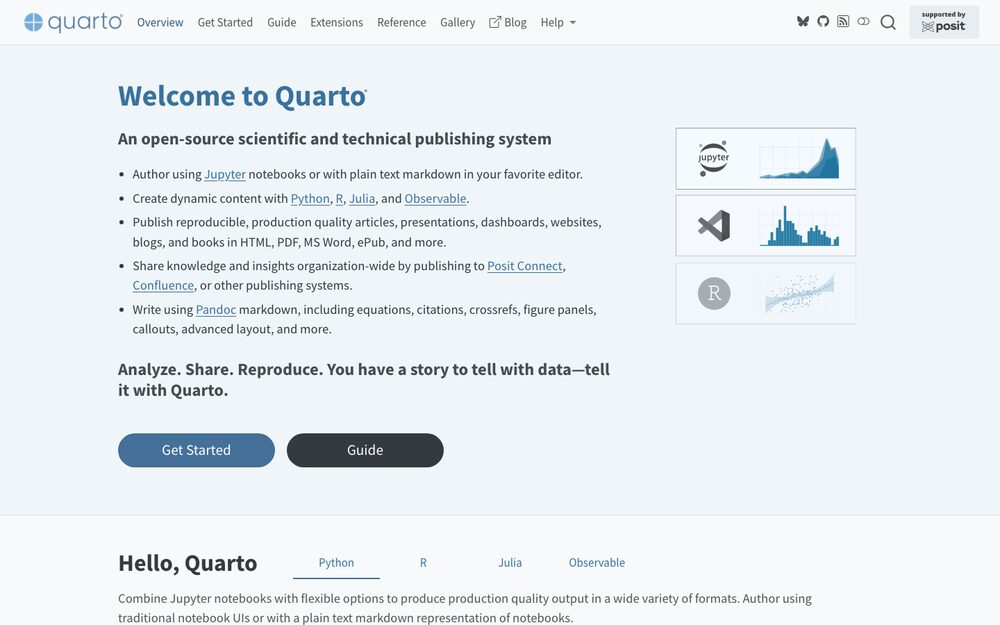
<div class="cap">quarto.org · screenshot, October 2026. Logos and screenshots belong to their owners.</div>
:::
::::

<div class="profile-links"><a href="https://quarto.org">quarto.org</a><a class="back" href="#/install-git-uv-quarto">← Back to Git, uv, and Quarto</a></div>

## Playwright: lets the AI see a web page {#tool-playwright}

<span class="kicker">Appendix B · Tool profile</span>


:::: {.profile-grid}
::: {.profile-text}
<div class="pf"><span class="label">What it is</span><p>A tool that controls a web browser from code. It can open pages, click, and take screenshots.</p></div>
<div class="pf"><span class="label">What the AI uses it for</span><p>"Open the slide I just made and screenshot it" so it can check its own work.</p></div>
<div class="pf"><span class="label">Try it</span><p>Ask the AI to screenshot any web page.</p></div>
:::
::: {.profile-shot}
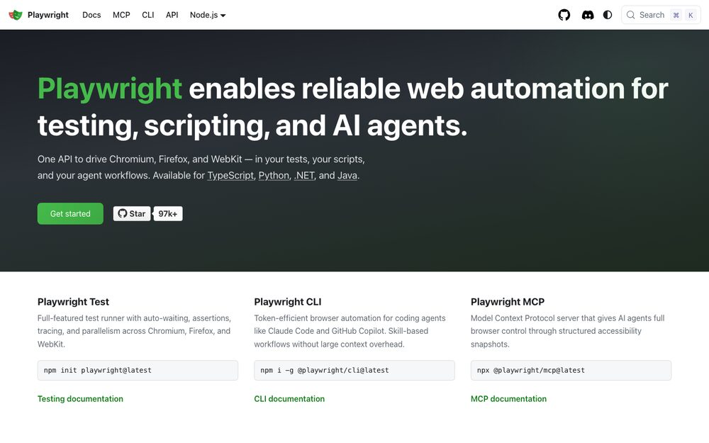
<div class="cap">playwright.dev · screenshot, October 2026. Logos and screenshots belong to their owners.</div>
:::
::::

<div class="profile-links"><a href="https://playwright.dev">playwright.dev</a><a class="back" href="#/install-playwright-node">← Back to Playwright and Node</a></div>

## Node.js: the engine behind many AI tools {#tool-node}

<span class="kicker">Appendix B · Tool profile</span>


:::: {.profile-grid}
::: {.profile-text}
<div class="pf"><span class="label">What it is</span><p>A program that runs JavaScript outside the browser. Many AI tools and web tools are built on it.</p></div>
<div class="pf"><span class="label">What the AI uses it for</span><p>Running AI tool servers and web-building tools it may reach for later.</p></div>
<div class="pf"><span class="label">Try it</span><p><code>node --version</code> prints a number.</p></div>
:::
::: {.profile-shot}
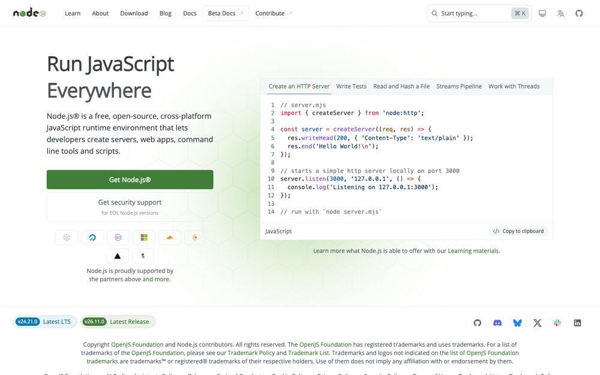
<div class="cap">nodejs.org · screenshot, October 2026. Logos and screenshots belong to their owners.</div>
:::
::::

<div class="profile-links"><a href="https://nodejs.org">nodejs.org</a><a class="back" href="#/install-playwright-node">← Back to Playwright and Node</a></div>

## GitHub: where your work can live online {#tool-github}

<span class="kicker">Appendix B · Tool profile</span>


:::: {.profile-grid}
::: {.profile-text}
<div class="pf"><span class="label">What it is</span><p>A free website that stores projects tracked with Git. You choose whether each project is private or public.</p></div>
<div class="pf"><span class="label">What the AI uses it for</span><p>Saving your project online, sharing it, and publishing slides as a web page.</p></div>
<div class="pf"><span class="label">Try it</span><p>Sign in at github.com and look at your profile.</p></div>
:::
::: {.profile-shot}
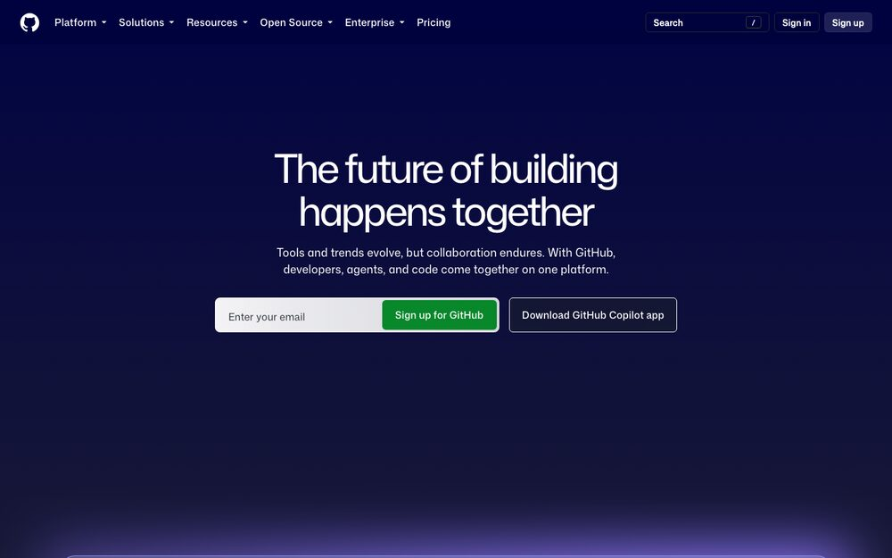
<div class="cap">github.com · screenshot, October 2026. Logos and screenshots belong to their owners.</div>
:::
::::

<div class="profile-links"><a href="https://github.com">github.com</a><a class="back" href="#/create-github-account">← Back to Create a GitHub account</a></div>

## GitHub CLI: GitHub from the terminal {#tool-gh}

<span class="kicker">Appendix B · Tool profile</span>


:::: {.profile-grid}
::: {.profile-text}
<div class="pf"><span class="label">What it is</span><p>The <code>gh</code> command signs you in to GitHub once, then lets tools use your account without passwords.</p></div>
<div class="pf"><span class="label">What the AI uses it for</span><p>"Create a repository for this project." "Publish these slides."</p></div>
<div class="pf"><span class="label">Try it</span><p><code>gh auth status</code> shows who is logged in.</p></div>
:::
::: {.profile-shot}
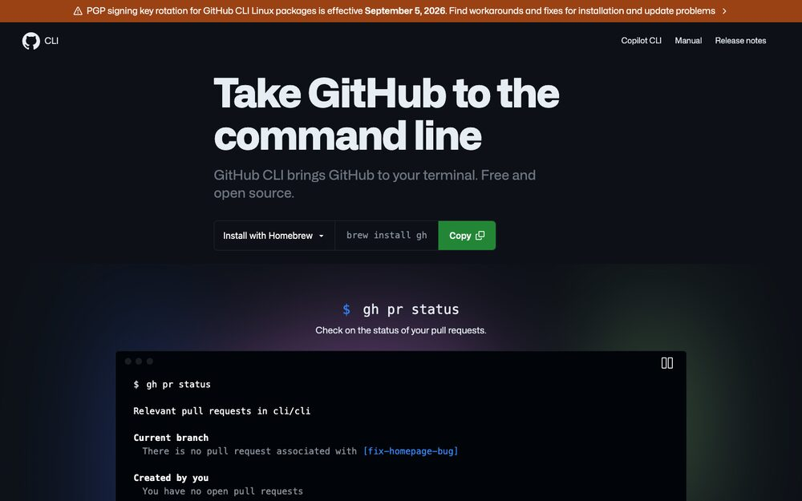
<div class="cap">cli.github.com · screenshot, October 2026. Logos and screenshots belong to their owners.</div>
:::
::::

<div class="profile-links"><a href="https://cli.github.com">cli.github.com</a><a class="back" href="#/connect-github">← Back to Connect GitHub</a></div>

## rig: R installs without the hassle {#tool-rig}

<span class="kicker">Appendix B · Tool profile</span>

:::: {.profile-grid}
::: {.profile-text}
<div class="pf"><span class="label">What it is</span><p>R Installation Manager. It installs R and switches between versions, much as uv does for Python.</p></div>
<div class="pf"><span class="label">What the AI uses it for</span><p>"Install the current R." "Switch to the version this project needs."</p></div>
<div class="pf"><span class="label">Try it</span><p><code>rig list</code> shows installed R versions.</p></div>
:::
::: {.profile-shot}
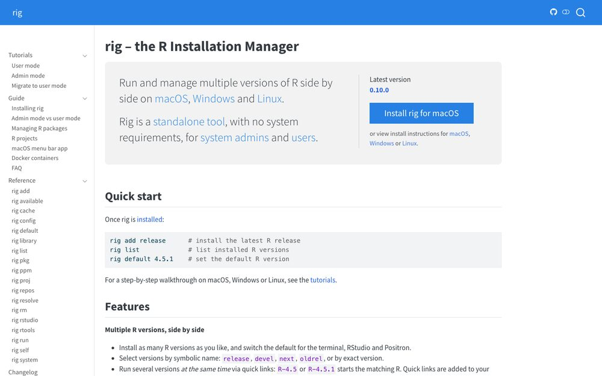
<div class="cap">rig.r-lib.org · screenshot, October 2026. Logos and screenshots belong to their owners.</div>
:::
::::

<div class="profile-links"><a href="https://github.com/r-lib/rig">github.com/r-lib/rig</a><a class="back" href="#/backup-r-rig">← Back to Need R?</a></div>

