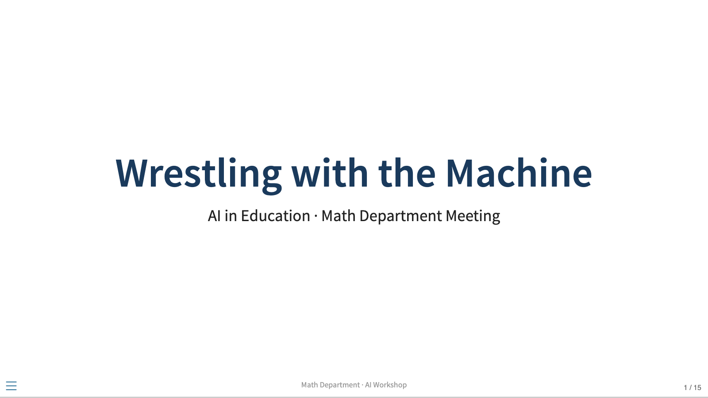
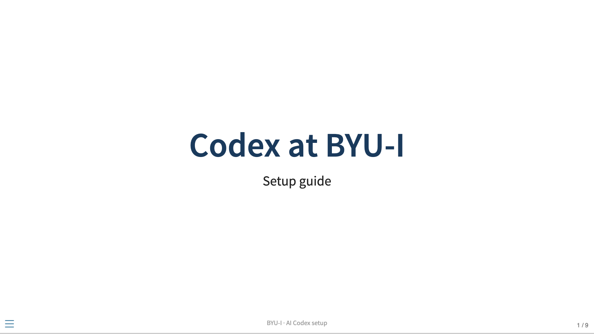
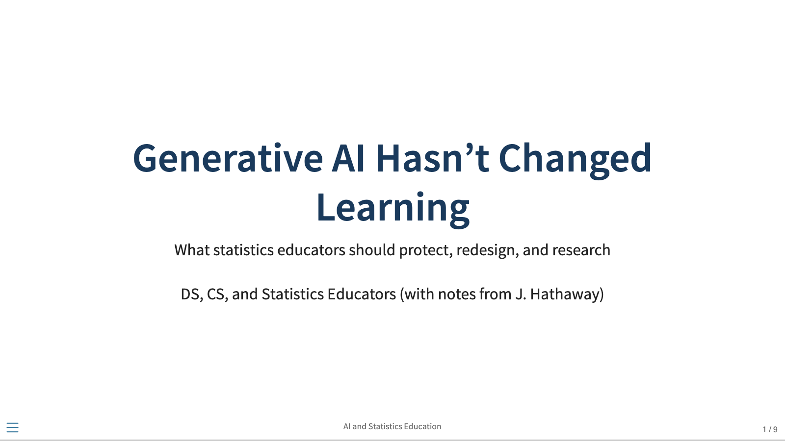
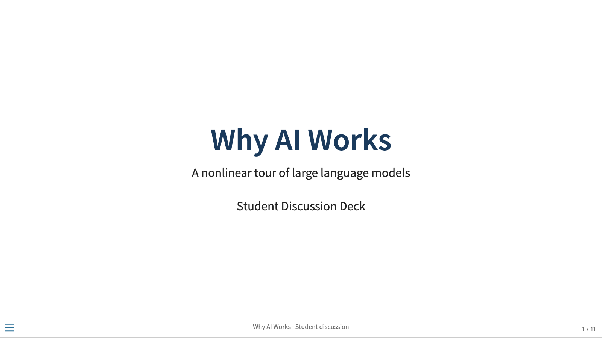

## Presentations

| Presentation | Overview |
| --- | --- |
|  | **[AI in Education Workshop](ai_introduction/ai-workshop-slides.html)**  <em>A faculty workshop on using AI to think more, with a collaborative problem-set activity and practical next steps.</em> |
|  | **[AI Codex Setup](ai_codex/ai-codex-setup-slides.html)**  <em>Setup guidance for BYU-Idaho departments, including Codex installation, the VS Code connection, and a teaching-tool activity.</em> |
|  | **[AI and Statistics Education](ai_stats_leaders/ai-stats-leaders-slides.html)**  <em>Research-informed discussion of mental models, novice and expert use of GenAI, practice, assessment, and expertise.</em> |
|  | **[Why AI Works](why_ai_works/why-ai-works-slides.html)**  <em>A student-friendly tour of the nonlinear science behind LLMs, including scaling laws, emergent abilities, grokking, criticality, and in-context learning.</em> |

Editable Quarto source files are available in the [repository README](https://github.com/byuistats/education_ai/blob/main/README.md).
